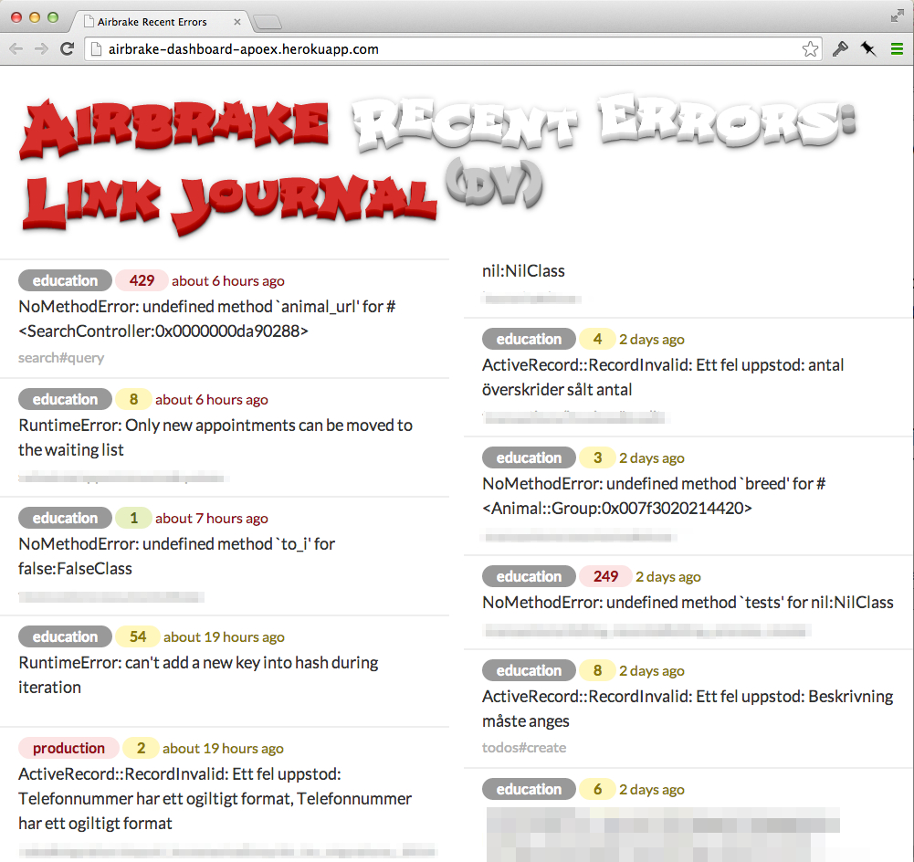

## README

Simple dashboard-UI created with Rails to give an overview of the latest errors
in Airbrake. The page auto-reloads every 2 mins.

This app does not require a database (at the moment).

### Getting Started

* Install Ruby 2.0.0
* `gem install bundler`
* `git clone git@github.com:johanlunds/airbrake_dashboard_app.git`
* `cd airbrake_dashboard_app`
* `bundle install`
* `cp env.example .env`
* Edit `.env`
* `foreman start`
* `open http://localhost:5000`

### Deploy to Heroku

* `gem install heroku`
* `heroku create`
* `git push heroku master`
* Set all config-vars: `heroku config:set HTTP_AUTH_PASSWORD=secret`... (see `.env` for variables that should be set)
* `heroku open`

### License

MIT.

Copyright Johan Lundström 2014.